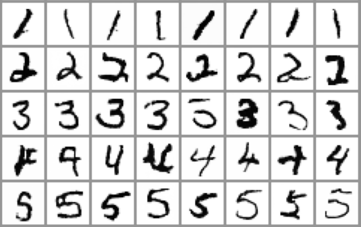

# 单元2: 微调，引导，条件生成

欢迎来到HuggingFace扩散模型课程的第二单元！在这一单元，你将会学到新的方法去使用和适配预训练过的扩散模型。你也会看到我们如何创建带有额外输入作为**生成条件**的扩散模型，以此控制生成过程。

## 开始这一单元 :rocket:

这里分几步学习这一单元：

- 请首先确保你已经[注册了本课程](https://huggingface.us17.list-manage.com/subscribe?u=7f57e683fa28b51bfc493d048&id=ef963b4162)，以便有新的学习资料时你会被通知到。
- 请先通读本文，对本单元的重点有一个整体的认识。
- 学习**Fine-tuning and Guidance**这节的笔记本，试着使用🤗 Diffusers库，在一个新数据集上微调（finetune）一个已有的扩散模型，以及用引导（guidance）这一方法修改采样过程。
- 照着记事本中的示例，把你的自定义模型做成Gradio的Demo分享出去。
- （可选）学习_**Class-conditioned Diffusion Model Example**_这节笔记本，看看我们如何给生成过程加入额外控制。

:loudspeaker: 别忘了加入[Discord](https://huggingface.co/join/discord)，在这里你可以参与学习资料的讨论，在`#diffusion-models-class`频道分享你的实验成果。

## 微调（Fine-Tuning）

正如你在第一单元看见的，从头训练一个扩散模型耗费的时间相当长！尤其是当你使用高分辨率图片时，从头训练模型所需的时间和数量量可能多得不切实际。幸运的是，我们还有个解决方法：从一个已经被训练过的模型去开始训练！这样，我们从一个已经学过如何去噪的模型开始，希望能相比于随机初始化的模型能有一个更好的起始点。

一般而言，当你的新数据和原有模型的原始训练数据多多少少有点相似的时候，微调效果会最好（比如你想生成卡通人脸，那你用于微调的模型最好是个在人脸数据上训练过的模型）。但让人吃惊的是，这些益处在图片分布变化显著时也会存在。上面的图片是通过微调一个[在LSUN卧室图片数据集上训练的模型](https://huggingface.co/google/ddpm-bedroom-256)而生成的，这个模型在[WikiArt数据集](https://huggingface.co/datasets/huggan/wikiart)被微调了500步。相关的[训练脚本](https://github.com/huggingface/diffusion-models-class/blob/main/unit2/finetune_model.py)也放在了本单元中供大家参考。

## 引导（Guidance）

无条件模型一般没有对生成能内容的掌控。我们可以训练一个条件模型（更过内容将会在下节讲述），接收额外输入，以此来操控生成过程。但我们如何使用一个已有的无条件模型去做这件事呢？我们可以用引导这一方法：生成过程中每一步的模型预测都将会被一些引导函数所评估，并加以修改，以此让最终的生成结果符合我们所想。

这个引导函数可以是任何函数，这让我们有了很大的设计空间。在笔记本中，我们从一个简单的例子（控制颜色，如上图所示）开始，到使用一个叫CLIP的预训练模型，让生成的结果基于文字描述。

## 条件生成（conditioning）

引导能让我们从一个无条件扩散模型中多少得到些额外的收益，但如果我们在训练过程中就有一些额外的信息（比如图像类别或文字描述）可以输入到模型里，我们可以把这些信息输入模型，让模型使用这些信息去做预测。由此我们就创建了一个条件模型，我们可以在推理阶段通过输入什么信息作为条件来控制模型生成什么。相关的笔记本中就展示了一个例子：一个类别条件的模型，可以根据类别标签生成对应的图像。

There are a number of ways to pass in this conditioning information, such as

有很多种方法可以把条件信息输入到模型种，比如：

* 把条件信息作为额外的通道输入给UNet。这种情况下一般条件信息都和图片有着相同的形状，比如条件信息是图像分割的掩模（mask）、深度图或模糊版的图像（针对图像修复、超分辨率任务的模型）。这种方法在一些其它条件下也可以用，比如在相应的笔记本的例子中，类别标签就被映射成了一个嵌入（embedding），并被展开成和输入图片一样的宽度和高度，以此来作为额外的通道输入到模型里。
* 把条件信息做成一个嵌入（embedding），然后把它映射到和模型其中一个或多个中间层输出的通道数一样，再把这个嵌入加到中间层输出上。这一般是以时间步（timestep）为条件时的做法。比如，你可以把时间步的嵌入映射到特定通道数，然后加到模型的每一个残差网络模块的输出上。这种方法在你有一个向量形式的条件时很有用，比如CLIP的图像嵌入。一个值得注意的例子是一个[能修改输入图片的Stable Diffusion模型](https://huggingface.co/spaces/lambdalabs/stable-diffusion-image-variations)。
* 添加有交叉注意力机制的网络层（cross-attention）。这在当条件是某种形式的文字时最有效 —— 比如文字被一个transformer模型映射成了一串embedding，那么UNet中有交叉注意力机制的网络层就会被用来把这些信息合并到去噪路径中。我们将在第三单元研究Stable Diffision如何处理文字信息条件时看到这种情况。

## 用来上手的笔记本示例

| Chapter                                     | Colab                                                                                                                                                                                               | Kaggle                                                                                                                                                                                                   | Gradient                                                                                                                                                                               | Studio Lab                                                                                                                                                                                                   |
|:--------------------------------------------|:----------------------------------------------------------------------------------------------------------------------------------------------------------------------------------------------------|:---------------------------------------------------------------------------------------------------------------------------------------------------------------------------------------------------------|:---------------------------------------------------------------------------------------------------------------------------------------------------------------------------------------|:-------------------------------------------------------------------------------------------------------------------------------------------------------------------------------------------------------------|
| Fine-tuning and Guidance                                |               |               |               |               |
| Class-conditioned Diffusion Model Example                               |               |               |               |               |

现在你已经准备好学习这些笔记本了！通过上面的链接使用你选择的平台打开它们！微调是个计算量很大的工作，所以如果你用的是Kaggle或Google Colab，请确保你把运行时类型设成GPU。

本单元内容的主体在_**Fine-tuning and Guidance**_这个笔记本中，我们将通过示例探索这两个话题。笔记本将会展示给你如何在新数据上微调现有模型，添加引导，以及在Gradio上分享结果。这里还有一个脚本程序[finetune_model.py](https://github.com/huggingface/diffusion-models-class/blob/main/unit2/finetune_model.py)，让你更容易地实验不同的微调设置；以及一个[示例的space](https://huggingface.co/spaces/johnowhitaker/color-guided-wikiart-diffusion)，你可以以此作为目标用来在🤗 Spaces上分享demo。

在 _**Class-conditioned Diffusion Model Example**_中，我们用MNIST数据集展示一个很简单的例子：创建一个以类别标签为条件的扩散模型。这里的重点在于尽可能简单地讲解核心要点：通过给模型提供额外的关于去除什么噪声的信息，我们可以在推理时控制哪种类型的图片是我们想要生成的。

## 项目时间

Following the examples in the _**Fine-tuning and Guidance**_ notebook, fine-tune your own model or pick an existing model and create a Gradio demo to showcase your new guidance skills. Don't forget to share your demo on Discord, Twitter etc so we can admire your work!

仿照_**Fine-tuning and Guidance**_笔记本中的例子，微调你自己的模型或挑选一个现有模型，创建Gradio的demo展示你的引导技巧。也不要忘了在Discord或Twitter之类的平台上分享，让我们也羡慕羡慕！

## 一些其它学习资源

[Denoising Diffusion Implicit Models](https://arxiv.org/abs/2010.02502) - 引出了DDIM采样方法（DDIMScheduler用到了这个方法）

[GLIDE: Towards Photorealistic Image Generation and Editing with Text-Guided Diffusion Models](https://arxiv.org/abs/2112.10741) - 介绍了如何让扩散模型基于文本类条件

[eDiffi: Text-to-Image Diffusion Models with an Ensemble of Expert Denoisers](https://arxiv.org/abs/2211.01324) - 展示了多少种不同的生成条件可以一起使用来对不同种类的生成样本施加更多的控制

如果你找到了更好的学习资源，也别忘了告诉我们让我们加到这个列表里！
